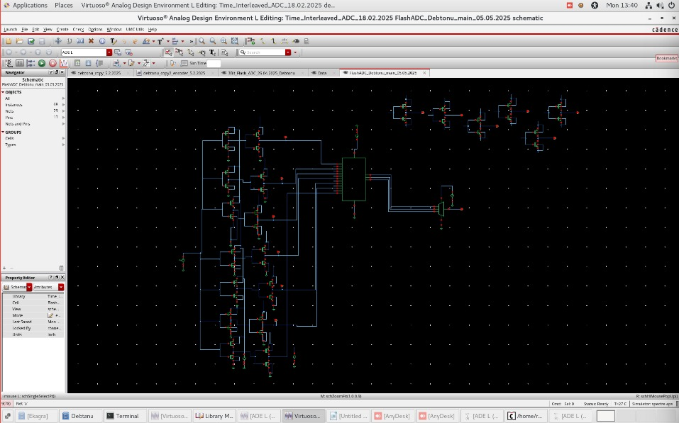
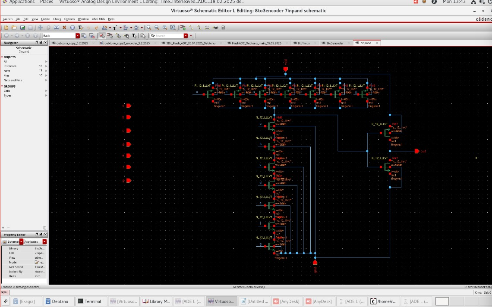
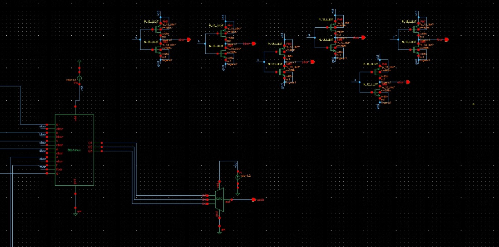

<div align="center">

# CMOS Flash ADC with TMCC-Based Comparator

[](https://www.cadence.com/)
[](/)
[](/)
[](/)
[](/)

**A fully custom transistor-level 3-bit Flash ADC using TMCC comparators and custom CMOS logic gates**

[Overview](#overview) | [Architecture](#architecture) | [Schematics](#schematics) | [Specifications](#specifications) | [Author](#author)

</div>

---

## About

This project was developed at **CSIR-CEERI, Pilani** (April 2025 - June 2025) as part of an Advanced VLSI Design research program. The Flash ADC demonstrates custom analog IC design techniques using fully transistor-level implementation without standard cells.

| | |
|---|---|
| **Institution** | CSIR-CEERI, Pilani |
| **Duration** | April 2025 - June 2025 |
| **Team Size** | 2 |
| **Role** | Team Member |
| **Tools** | Cadence EDA (Virtuoso, ADE L, Spectre) |

---

## Overview

This project presents a complete transistor-level design of a **3-bit Flash Analog-to-Digital Converter (ADC)** implemented in **Cadence Virtuoso**. The design utilizes **Threshold-Modulated Current Comparator (TMCC)** architecture for high-speed analog threshold detection.

**Key Achievements:**
- Designed custom Flash ADC using TMCC comparators and transistor-level encoder
- Implemented CMOS-based 4-input OR gates to process thermometer code
- Built custom AND gates to convert TMCC outputs into clean digital levels
- Successfully created complete Flash ADC from comparators to binary encoder
- Optimized for low latency and robust analog-to-digital conversion

---

## Architecture

<div align="center">


*Complete 3-bit Flash ADC schematic in Cadence Virtuoso*
</div>

### System Block Diagram

```
                                    +------------------+
     Analog Input  ──────────────>  |  TMCC Comparator |
         (Vin)                      |     Array (7x)   |
                                    +--------+---------+
                                             |
                                    Thermometer Code (T1-T7)
                                             |
                                             v
                                    +------------------+
                                    |   AND Gate Array |
                                    | (Level Restore)  |
                                    +--------+---------+
                                             |
                                             v
                                    +------------------+
                                    |  8-to-3 Encoder  |
                                    | (OR Gate Network)|
                                    +--------+---------+
                                             |
                                    Binary Output (B2, B1, B0)
                                             |
                                             v
                                       3-bit Digital
```

---

## Design Stages

### 1. TMCC Comparator Stage

The **Threshold-Modulated Current Comparator (TMCC)** detects when the input voltage exceeds predefined reference levels:

| Feature | Description |
|---------|-------------|
| **Function** | Analog voltage comparison |
| **Output** | Thermometer-encoded signals |
| **Technique** | Current modulation based on threshold |
| **Count** | 7 comparators for 3-bit resolution |

### 2. Logic Conversion Stage

<div align="center">


*Custom AND gate for logic level restoration*
</div>

- TMCC outputs converted to valid digital levels using **custom CMOS AND gates**
- Each gate designed at transistor level using complementary pMOS/nMOS
- Provides clean logic transitions for encoder input

### 3. Encoder Stage

<div align="center">
<table>
<tr>
<td></td>
<td></td>
</tr>
<tr>
<td align="center"><em>Custom 4-input OR gate (transistor level)</em></td>
<td align="center"><em>8-to-3 thermometer-to-binary encoder</em></td>
</tr>
</table>
</div>

The encoder implements **thermometer-to-binary conversion**:

| Thermometer Code | Binary Output |
|------------------|---------------|
| 0000000 | 000 |
| 0000001 | 001 |
| 0000011 | 010 |
| 0000111 | 011 |
| 0001111 | 100 |
| 0011111 | 101 |
| 0111111 | 110 |
| 1111111 | 111 |

---

## Top-Level Integration

<div align="center">


*Top-level schematic showing AND gate cases and 8-to-3 encoder blocks*
</div>

<div align="center">


*Complete encoder section with DAC feedback*
</div>

---

## Specifications

| Parameter | Value |
|-----------|-------|
| **Resolution** | 3-bit |
| **Technology** | gpdk060nm CMOS |
| **Supply Voltage** | 1.2 V |
| **Comparator Type** | TMCC (Threshold-Modulated Current) |
| **Logic Style** | Complementary CMOS |
| **Number of Comparators** | 7 |
| **Quantization Levels** | 8 |

---

## Design Highlights

| Feature | Benefit |
|---------|---------|
| **Fully Custom Design** | No standard cells - complete transistor-level control |
| **TMCC Comparators** | Improved sensitivity and speed over conventional designs |
| **Complementary CMOS** | Low static power, rail-to-rail swing |
| **Hierarchical Structure** | Modular design for easy verification |
| **Simulation Verified** | Spectre transient and DC analysis |

---

## Tools and Technology

| Category | Specification |
|----------|---------------|
| **Design Environment** | Cadence Virtuoso (ADE L) |
| **Simulation Engine** | Spectre |
| **Technology Node** | gpdk060nm CMOS |
| **Supply Voltage** | 1.2 V |
| **Logic Type** | Custom CMOS (pMOS + nMOS) |

---

## Project Structure

```
CMOS-Flash-ADC/
├── README.md
└── images/
    └── schematics/
        ├── flash_adc_full.jpeg      # Complete ADC schematic
        ├── encoder_with_dac.jpeg    # Encoder section with DAC
        ├── 4input_or_gate.jpeg      # OR gate transistor design
        ├── 8to3_encoder.jpeg        # Thermometer-to-binary encoder
        ├── 7input_and_gate.jpeg     # AND gate transistor design
        └── top_level_mux.jpeg       # Top-level integration
```

---

## Simulation Results

- **Comparator Functionality**: Verified through transient and DC analysis
- **Thermometer-to-Binary**: Correct transitions across input voltage range
- **Propagation Delay**: Minimal delay suitable for high-speed applications
- **Power Consumption**: Low static power due to complementary CMOS design

---

## Author

**Debtonu Bose**
B.Tech Electronics and Communication Engineering
Vellore Institute of Technology (2021-2025)

[](https://github.com/DarkDragoXE)
[](https://linkedin.com/in/debtonu-bose)

---

## Acknowledgments

- **CSIR-CEERI, Pilani** for providing access to Cadence EDA tools and research guidance
- Advanced VLSI Design Workshop (March 2025) for foundational training in analog and mixed-signal design

---

## Future Enhancements

- [ ] Add layout design (physical implementation)
- [ ] Include simulation waveforms and testbench results
- [ ] Extend to higher resolution (4-bit, 6-bit)
- [ ] Power and timing characterization
- [ ] Export Cadence project files

---

<div align="center">

**Custom Analog IC Design | CSIR-CEERI, Pilani | Cadence EDA**

</div>
